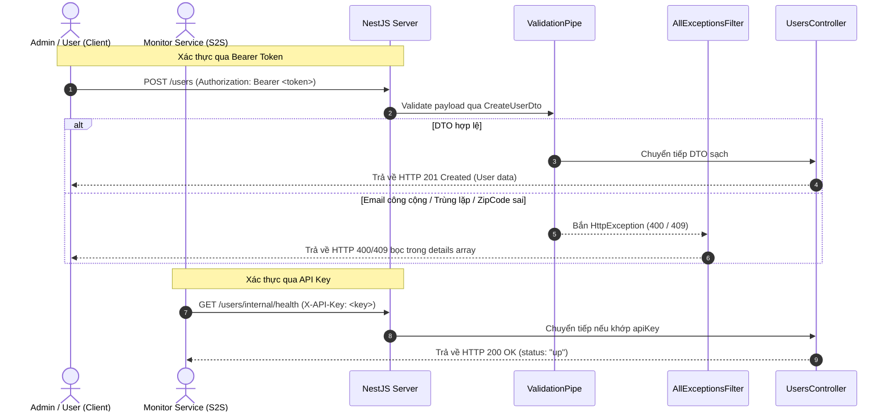

# NestJS Task & User Management REST API with Swagger Documentation

Hệ thống quản lý công việc (Task Management) và người dùng (User Management) được tích hợp tài liệu hướng dẫn giao diện lập trình ứng dụng (API Documentation) tự động bằng cách sử dụng `@nestjs/swagger` theo chuẩn OpenAPI Spec.

---

## 1. Challenge Description

Bài toán tập trung xây dựng hệ thống tài liệu API trực quan, bảo mật phân cấp và chuyên nghiệp với hai phân hệ chính:

### A. Phân hệ Quản lý Công việc (Tasks Module)
- **Cấu hình Swagger toàn cục**: Mount Swagger UI tại đường dẫn `/docs` với tài liệu JSON raw tại `/docs-json`.
- **Trang trí DTO & Model Schema**: Sử dụng `@ApiProperty` để tự động hóa sinh tài liệu schema và prefill mẫu payload.
- **Mô tả Endpoint**: Phân nhóm API bằng tag `Tasks` thông qua `@ApiTags()`, mô tả chức năng bằng `@ApiOperation()`, và phản hồi bằng `@ApiResponse()`.

### B. Phân hệ Quản lý Người dùng (Users Module)
- **Đa Response Code**: Cấu hình phản hồi chi tiết (200, 201, 400, 404, 409) cho từng endpoint với ví dụ payload thực tế.
- **Trang trí DTO nâng cao**: Sử dụng `@ApiProperty` và `@ApiPropertyOptional` cho các trường dữ liệu, đồng bộ hóa các ràng buộc dữ liệu đầu vào (ví dụ: `@MinLength(8)` tương ứng với `minLength: 8`) và hiển thị dropdown cho các kiểu dữ liệu `enum` (`UserRole`).
- **Phân tách Security Scheme**:
  - `bearer`: JWT Bearer Token dành cho luồng người dùng/quản trị viên (`POST /users`).
  - `apiKey`: API Key truyền qua Header `X-API-Key` dành cho dịch vụ giám sát nội bộ (`GET /users/internal/health`).
- **Tổ hợp Schema Envelope**: Sử dụng `getSchemaPath()` kết hợp với `allOf` để định nghĩa kiểu dữ liệu phản hồi bọc qua Transform Interceptor của hệ thống.

---

## 2. How to Run

### Yêu cầu môi trường
- **Node.js**: >= 18.x
- **npm**: >= 9.x

### Lệnh khởi chạy và kiểm thử

1. **Khởi chạy máy chủ (Listening on port 3000)**:
   ```bash
   npm run start:dev
   ```

2. **Truy cập Giao diện Swagger UI**:
   - Mở trình duyệt và truy cập: `http://localhost:3000/docs`

3. **Truy cập Raw OpenAPI Spec (JSON)**:
   - Truy cập: `http://localhost:3000/docs-json`

4. **Chạy các bộ kiểm thử tự động**:
   ```bash
   npm test
   npm run test:e2e
   ```

---

## 3. Architecture / Stack

Hệ thống được phát triển trên các thư viện cốt lõi:
- **NestJS v11.x**, **TypeScript v5.7**
- **@nestjs/swagger v11.x**: Động cơ sinh tài liệu tự động qua decorator metadata.
- **class-validator** & **class-transformer** làm động cơ kiểm thực.

### Sơ đồ luồng hoạt động Swagger & Security (Mermaid Diagram)



---

## 4. Smoke Test (Evidence Thực Tế)

Dưới đây là bằng chứng thực tế thu thập từ việc chạy ứng dụng và truy cập API:

### Excerpt JSON từ `/docs-json` (Chứng minh schema `CreateUserDto` có đủ field + constraint)
```json
{
  "CreateUserDto": {
    "type": "object",
    "properties": {
      "email": {
        "type": "string",
        "example": "john.doe@company.com",
        "description": "The corporate email address of the user"
      },
      "username": {
        "type": "string",
        "example": "johndoe",
        "description": "The unique username of the user",
        "minLength": 3
      },
      "password": {
        "type": "string",
        "example": "P@ssword123",
        "description": "The secure password of the user (minimum 8 characters)",
        "minLength": 8
      },
      "role": {
        "type": "string",
        "enum": [
          "admin",
          "user"
        ],
        "example": "user",
        "description": "The system role assigned to the user"
      },
      "address": {
        "$ref": "#/components/schemas/AddressDto",
        "description": "The physical address of the user"
      },
      "phoneNumber": {
        "type": "string",
        "example": "+1234567890",
        "description": "Optional contact phone number of the user"
      }
    },
    "required": [
      "email",
      "username",
      "password",
      "role",
      "address"
    ]
  }
}
```

---

### Các ca kiểm thử thực tế (Smoke Test Cases)

#### Case 1: Đọc Raw OpenAPI Specification JSON (`GET /docs-json`)
- **Request**:
  ```bash
  curl -s http://localhost:3000/docs-json
  ```
- **Response Spec (Trích xuất paths và securitySchemes)**:
  ```json
  {
    "openapi": "3.0.0",
    "paths": {
      "/users": {
        "post": {
          "operationId": "UsersController_create",
          "security": [{"bearer": []}]
        }
      },
      "/users/internal/health": {
        "get": {
          "operationId": "UsersController_health",
          "security": [{"apiKey": []}]
        }
      }
    },
    "components": {
      "securitySchemes": {
        "bearer": {
          "scheme": "bearer",
          "bearerFormat": "JWT",
          "type": "http"
        },
        "apiKey": {
          "type": "apiKey",
          "name": "X-API-Key",
          "in": "header"
        }
      }
    }
  }
  ```

#### Case 2: POST `/users` - Đăng ký thành công (`201 Created`)
- **Request**:
  ```bash
  curl -X POST http://localhost:3000/users \
    -H "Content-Type: application/json" \
    -H "Authorization: Bearer my-admin-token" \
    -d '{
      "email": "john.doe@company.com",
      "username": "johndoe",
      "password": "supersecurepassword123",
      "role": "user",
      "address": {
        "street": "123 Main Street",
        "city": "New York",
        "zipCode": "10001"
      }
    }'
  ```
- **Response**:
  ```json
  {
    "statusCode": 201,
    "message": "SUCCESS",
    "data": {
      "id": "mpv3k4h5a",
      "email": "john.doe@company.com",
      "username": "johndoe",
      "role": "user",
      "address": {
        "street": "123 Main Street",
        "city": "New York",
        "zipCode": "10001"
      }
    },
    "timestamp": "2026-06-01T11:20:20.008Z"
  }
  ```

#### Case 3: POST `/users` - Thất bại do lỗi định dạng / email công cộng (`400 Bad Request`)
- **Request**:
  ```bash
  curl -X POST http://localhost:3000/users \
    -H "Content-Type: application/json" \
    -H "Authorization: Bearer my-admin-token" \
    -d '{
      "email": "john.doe@gmail.com",
      "username": "jo",
      "password": "123",
      "role": "user",
      "address": {
        "street": "123 Main Street",
        "city": "New York",
        "zipCode": "12"
      }
    }'
  ```
- **Response**:
  ```json
  {
    "statusCode": 400,
    "error": "BadRequestException",
    "message": "email must be a corporate email address (public domains like gmail.com, yahoo.com, hotmail.com, or outlook.com are not allowed)",
    "details": [
      "email must be a corporate email address (public domains like gmail.com, yahoo.com, hotmail.com, or outlook.com are not allowed)",
      "username must be longer than or equal to 3 characters",
      "password must be longer than or equal to 8 characters",
      "address.zipCode must be a numeric string between 4 and 10 digits"
    ],
    "timestamp": "2026-06-01T11:20:22.100Z",
    "path": "/users"
  }
  ```

#### Case 4: POST `/users` - Thất bại do trùng lặp email (`409 Conflict`)
- **Request**:
  ```bash
  curl -X POST http://localhost:3000/users \
    -H "Content-Type: application/json" \
    -H "Authorization: Bearer my-admin-token" \
    -d '{
      "email": "john.doe@company.com",
      "username": "johndoe",
      "password": "supersecurepassword123",
      "role": "user",
      "address": {
        "street": "123 Main Street",
        "city": "New York",
        "zipCode": "10001"
      }
    }'
  ```
- **Response**:
  ```json
  {
    "statusCode": 409,
    "error": "ConflictException",
    "message": "Email john.doe@company.com is already registered",
    "timestamp": "2026-06-01T11:20:25.150Z",
    "path": "/users"
  }
  ```

#### Case 5: GET `/users/:id` - Thất bại do ID không tồn tại (`404 Not Found`)
- **Request**:
  ```bash
  curl http://localhost:3000/users/non-existent-id
  ```
- **Response**:
  ```json
  {
    "statusCode": 404,
    "error": "NotFoundException",
    "message": "User with ID \"non-existent-id\" not found",
    "timestamp": "2026-06-01T11:20:40.000Z",
    "path": "/users/non-existent-id"
  }
  ```

#### Case 6: GET `/users/internal/health` - Health check dịch vụ nội bộ (`200 OK` với API Key)
- **Request**:
  ```bash
  curl -H "X-API-Key: my-secret-api-key" http://localhost:3000/users/internal/health
  ```
- **Response**:
  ```json
  {
    "statusCode": 200,
    "message": "SUCCESS",
    "data": {
      "status": "up"
    },
    "timestamp": "2026-06-01T11:20:45.000Z"
  }
  ```

---

## 5. Code Execution Trace (Luồng Đăng ký Người dùng - `POST /users`)

Luồng xử lý từ khi Client gửi payload lên endpoint `/users` đi qua các điểm chạm sau:

1. **Điểm chạm 1 - Khởi tạo Router & Route Handler**:
   - **File & Dòng**: [src/users/users.controller.ts:24](file:///d:/Nghia-project/escape-beta/task-management/src/users/users.controller.ts#L24)
   - **Mã nguồn**:
     ```typescript
     @Post()
     @ApiBearerAuth('bearer')
     @ApiOperation({ summary: 'Create a new user (Admin Only)' })
     create(@Body() createUserDto: CreateUserDto) {
     ```
   - **Mô tả**: Khai báo HTTP method, đường dẫn `/users`, cơ chế xác thực JWT và hứng DTO từ request body.

2. **Điểm chạm 2 - Cấu trúc dữ liệu và Ràng buộc Validation**:
   - **File & Dòng**: [src/users/dto/create-user.dto.ts:13](file:///d:/Nghia-project/escape-beta/task-management/src/users/dto/create-user.dto.ts#L13)
   - **Mã nguồn**:
     ```typescript
     export class CreateUserDto {
       @ApiProperty({ ... })
       @IsEmail()
       @IsCorporateEmail()
       email: string;
     ```
   - **Mô tả**: `ValidationPipe` toàn cục chặn request để kiểm tra định dạng email và các thuộc tính khác.

3. **Điểm chạm 3 - Chạy Custom Validator `IsCorporateEmail`**:
   - **File & Dòng**: [src/users/validators/is-corporate-email.validator.ts:11](file:///d:/Nghia-project/escape-beta/task-management/src/users/validators/is-corporate-email.validator.ts#L11)
   - **Mã nguồn**:
     ```typescript
     validate(value: any, args: ValidationArguments) {
       // logic chuyển chữ thường và so khớp domain blocklist
       const domain = parts[1].toLowerCase();
       return !blockList.includes(domain);
     }
     ```
   - **Mô tả**: Lớp validator tùy biến kiểm tra định dạng email của doanh nghiệp và tránh bypass bằng ký tự viết hoa.

4. **Điểm chạm 4 - Xử lý Service & Ném Lỗi Trùng Lặp**:
   - **File & Dòng**: [src/users/users.service.ts:8](file:///d:/Nghia-project/escape-beta/task-management/src/users/users.service.ts#L8)
   - **Mã nguồn**:
     ```typescript
     create(createUserDto: CreateUserDto) {
       const emailExists = this.users.some(...);
       if (emailExists) {
         throw new ConflictException(`Email ${createUserDto.email} is already registered`);
       }
     ```
   - **Mô tả**: Kiểm tra email trong Map/Array dữ liệu; nếu tồn tại thì ném ra lỗi `ConflictException` (HTTP 409).

5. **Điểm chạm 5 - Exception Filter định dạng response**:
   - **File & Dòng**: [src/common/filters/all-exceptions.filter.ts:36](file:///d:/Nghia-project/escape-beta/task-management/src/common/filters/all-exceptions.filter.ts#L36)
   - **Mã nguồn**:
     ```typescript
     private resolveDetails(exception: any) {
       // logic bóc tách message array sang field details
     }
     ```
   - **Mô tả**: Intercept exception ném từ service/pipe và định dạng lại cấu trúc JSON trước khi trả về client.

---

## 6. Design Decisions

### A. Chọn mount Swagger UI tại `/docs` thay vì `/api` hoặc `/swagger`
- **Quyết định**: Cấu hình đường dẫn tài liệu mặc định là `/docs`.
- **Trade-off**: Rất trực quan và phổ biến đối với các nhà phát triển frontend khi tìm kiếm tài liệu. Đồng thời, nó tách biệt hoàn toàn với phân vùng API chạy thực tế, giúp dễ dàng cấu hình quy tắc bảo mật chặn truy cập `/docs` ở môi trường production ở mức Reverse Proxy (Nginx/Cloudflare).

### B. Sử dụng Decorator-Driven Swagger Spec thay vì viết tay YAML/JSON
- **Quyết định**: Sử dụng `@nestjs/swagger` để tự động sinh tài liệu từ mã nguồn.
- **Trade-off**: Giúp code trở thành "Single Source of Truth". Khi lập trình viên thay đổi trường dữ liệu hoặc validator trong DTO class, tài liệu Swagger sẽ tự động cập nhật ngay khi build mà không sợ bị lệch pha (out of sync).

### C. Sử dụng Nested DTO thay vì Single Flat Object
- **Quyết định**: Tách thông tin địa chỉ ra thành một DTO con `AddressDto` lồng bên trong `CreateUserDto` thay vì đưa toàn bộ các trường lên cùng cấp.
- **Trade-off**: Giúp cấu trúc dữ liệu rõ ràng hơn, phản ánh đúng mô hình domain (một User có một Address). `AddressDto` có thể được tái sử dụng ở các endpoint khác (ví dụ: cập nhật địa chỉ, đăng ký nhà cung cấp). Để validate nested object, NestJS yêu cầu kết hợp `@ValidateNested()` và `@Type(() => AddressDto)` để ép kiểu JSON object sang instance của DTO class trước khi áp dụng các luật kiểm thực.

### D. Triển khai Custom Validator `IsCorporateEmail` thông qua `registerDecorator`
- **Quyết định**: Xây dựng một decorator tự định nghĩa `@IsCorporateEmail()` để chặn các email từ nhà cung cấp công cộng (gmail.com, yahoo.com, v.v.).
- **Trade-off**: Cho phép kiểm soát chặt chẽ quy trình so khớp email. Việc chuyển domain về dạng chữ thường (`.toLowerCase()`) trước khi so sánh giúp ngăn chặn việc bypass qua các email viết hoa dạng `user@GMAIL.COM` hay `user@Yahoo.Com`. Đồng thời, thông báo lỗi có thể tùy chỉnh rõ ràng hơn.

### E. Phân tách Security Scheme (Bearer Auth & ApiKey Auth)
- **Quyết định**: Đăng ký đồng thời cơ chế xác thực JWT Bearer (`bearer` dành cho người dùng/admin) và API Key (`apiKey` dành cho dịch vụ nội bộ service-to-service).
- **Trade-off**: Đảm bảo đúng nguyên tắc phân quyền (least privilege). Các API quản lý trực tiếp bởi con người (`POST /users`) được khóa qua Token Bearer cá nhân; trong khi các API đo lường hiệu năng/health check (`GET /users/internal/health`) được bảo mật bằng Header API Key dành cho các công cụ giám sát (Prometheus, Kubernetes). Nó giúp tránh rò rỉ token quyền cao của quản trị viên cho các hệ thống giám sát tự động.

### F. Tổ hợp Schema Envelope thông qua `allOf` và `getSchemaPath`
- **Quyết định**: Sử dụng `getSchemaPath(UserDto)` kết hợp với `allOf` để định nghĩa phản hồi đã được bọc qua Transform Interceptor (Standard Response Envelope).
- **Trade-off**: Tạo ra các schema phản hồi vô cùng chính xác, mô tả đúng thực tế trường `data` chứa thông tin gì (đối tượng đơn lẻ hay mảng đối tượng `UserDto[]`) cùng với các trường metadata bao ngoài (`statusCode`, `message`, `timestamp`). Việc khai báo `@ApiExtraModels(UserDto)` tại Controller là bắt buộc để Swagger module có thể biên dịch ra schema thô của `UserDto` dù nó không trực tiếp xuất hiện làm kiểu trả về gốc của method.
