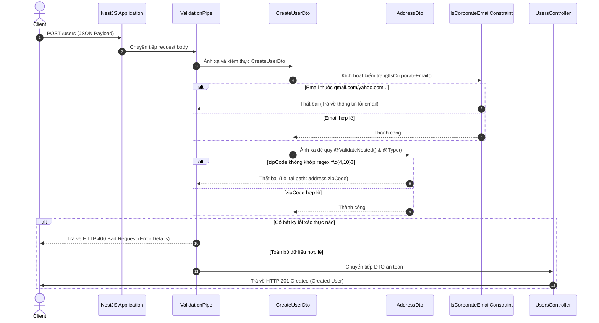

# NestJS Request Validation & Mass-Assignment Protection

Dự án giới thiệu giải pháp xác thực request nâng cao sử dụng NestJS, bao gồm kiểm thực lồng nhau đệ quy (Recursive Nested DTO validation) và triển khai custom validator decorator chống rò rỉ dữ liệu hoặc mass-assignment.

---

## 1. Challenge Description

Bài toán tập trung giải quyết các bài toán xác thực dữ liệu phức tạp ở biên hệ thống (API Gateway/Controller) trước khi đi vào tầng logic nghiệp vụ:
- **Nested DTO Validation**: Thiết lập mối quan hệ lồng nhau giữa `CreateUserDto` và `AddressDto` để kiểm thực toàn bộ dữ liệu địa chỉ gửi lên.
  - Ràng buộc: `street` (chuỗi >= 3 ký tự), `city` (chuỗi >= 2 ký tự), `zipCode` (phải là số dài từ 4-10 ký tự).
  - Yêu cầu đệ quy: Payload lỗi ở nested property phải hiển thị chính xác đường dẫn lỗi dưới dạng `address.zipCode` và trả về mã lỗi HTTP `400 Bad Request`.
- **Custom Decorator `@IsCorporateEmail()`**: Chặn các email đăng ký tài khoản từ nhà cung cấp dịch vụ công cộng như Gmail, Yahoo, Hotmail, Outlook.
  - Yêu cầu an toàn: Chuyển đổi chữ thường (lowercase) domain trước khi so khớp để tránh bypass bằng cách viết hoa chữ cái (ví dụ: `john.doe@GMAIL.COM`).
  - Yêu cầu mở rộng: Hỗ trợ tùy biến thông báo lỗi thông qua `validationOptions`.
- **Unit & Integration Testing**: Viết unit test cho constraint của custom decorator và integration e2e test để tự động hóa kiểm định cả 3 nhánh flow chính của API `/users`.

---

## 2. How to Run

### Yêu cầu môi trường
- **Node.js**: >= 18.x
- **npm**: >= 9.x

### Lệnh chạy kiểm thử và vận hành

1. **Khởi chạy kiểm thử đơn vị (Unit Tests)**:
   ```bash
   npm test
   ```
   *Chạy toàn bộ các test suite kiểm thử logic của custom email validator.*

2. **Khởi chạy kiểm thử tích hợp (E2E Integration Tests)**:
   ```bash
   npm run test:e2e
   ```
   *Chạy toàn bộ kiểm thử tích hợp HTTP sử dụng supertest và NestJS testing module.*

3. **Biên dịch dự án**:
   ```bash
   npm run build
   ```

4. **Khởi chạy máy chủ sản phẩm**:
   ```bash
   node dist/main.js
   ```

---

## 3. Architecture / Stack

Hệ thống được phát triển trên nền tảng:
- **NestJS v11.x** & **TypeScript v5.7**
- **class-validator** & **class-transformer** làm động cơ validate.
- **Supertest** & **Jest** phục vụ viết và chạy kiểm thử tự động.

### Sơ đồ Quy trình Xác thực (Mermaid Diagram)



---

## 4. Smoke Test (Evidence Thực Tế)

Dưới đây là kết quả log thực tế thu được từ máy chủ NestJS khi gửi các request kiểm thực:

### Case 1: Hợp lệ (Valid corporate user) -> `201 Created`
- **Request**:
  ```bash
  curl -i -X POST http://localhost:3000/users -H "Content-Type: application/json" -d '{"email":"john.doe@company.com","address":{"street":"123 Main Street","city":"New York","zipCode":"10001"}}'
  ```
- **Response**:
  ```http
  HTTP/1.1 201 Created
  Content-Type: application/json; charset=utf-8
  ```
  ```json
  {"id":"mpu8pxjuo87","email":"john.doe@company.com","address":{"street":"123 Main Street","city":"New York","zipCode":"10001"}}
  ```

### Case 2: Gmail bị chặn (Gmail reject) -> `400 Bad Request`
- **Request**:
  ```bash
  curl -i -X POST http://localhost:3000/users -H "Content-Type: application/json" -d '{"email":"john.doe@gmail.com","address":{"street":"123 Main Street","city":"New York","zipCode":"10001"}}'
  ```
- **Response**:
  ```http
  HTTP/1.1 400 Bad Request
  Content-Type: application/json; charset=utf-8
  ```
  ```json
  {
    "message": [
      "email must be a corporate email address (public domains like gmail.com, yahoo.com, hotmail.com, or outlook.com are not allowed)"
    ],
    "error": "Bad Request",
    "statusCode": 400
  }
  ```

### Case 3: ZipCode không hợp lệ (Bad zipCode) -> `400 Bad Request`
- **Request**:
  ```bash
  curl -i -X POST http://localhost:3000/users -H "Content-Type: application/json" -d '{"email":"john.doe@company.com","address":{"street":"123 Main Street","city":"New York","zipCode":"12"}}'
  ```
- **Response**:
  ```http
  HTTP/1.1 400 Bad Request
  Content-Type: application/json; charset=utf-8
  ```
  ```json
  {
    "message": [
      "address.zipCode must be a numeric string between 4 and 10 digits"
    ],
    "error": "Bad Request",
    "statusCode": 400
  }
  ```

### Case 4: Minh họa bỏ quên `@Type` (Bypass validation) -> `201 Created`
Dưới đây là phần code diff minh họa tác hại khi xóa decorator `@Type(() => AddressDto)` khỏi thuộc tính `address` trong DTO:

```diff
  export class CreateUserDto {
    @IsEmail()
    @IsCorporateEmail()
    email: string;
 
    @IsDefined({ message: 'address is required' })
    @ValidateNested()
-   @Type(() => AddressDto)
    address: AddressDto;
  }
```

- **Tác hại**: Khi xóa dòng `@Type(() => AddressDto)`, nếu client gửi lên payload có `zipCode` không hợp lệ (ví dụ: `"zipCode": "12"`), NestJS sẽ **không** báo lỗi và vẫn trả về `201 Created`. Lý do là không có constructor để ánh xạ JSON thô thành thực thể `AddressDto`, khiến `class-validator` bỏ qua bước kiểm tra `@ValidateNested()`.

---

## 5. Code Execution Trace (Flow POST /users)

Request `POST /users` đi qua 5 điểm chạm chính xác trong source code để thực hiện validate:

1. **Điểm chạm 1 - Đăng ký ValidationPipe toàn cục**:
   - **File & Dòng**: [src/main.ts:22](file:///d:/Nghia-project/escape-beta/task-management/src/main.ts#L22)
   - **Mã nguồn**: `app.useGlobalPipes(new ValidationPipe({ whitelist: true, forbidNonWhitelisted: true }))`
   - **Mô tả**: Kích hoạt bộ lọc ValidationPipe toàn cục để xử lý request trước khi truyền vào Controller.

2. **Điểm chạm 2 - Khai báo DTO & Ràng buộc đệ quy**:
   - **File & Dòng**: [src/users/dto/create-user.dto.ts:6](file:///d:/Nghia-project/escape-beta/task-management/src/users/dto/create-user.dto.ts#L6)
   - **Mã nguồn**: `CreateUserDto` sử dụng cặp decorator `@ValidateNested()` và `@Type(() => AddressDto)`.
   - **Mô tả**: ValidationPipe đọc metadata từ class này để xác định rằng trường `address` phải được validate lồng đệ quy.

3. **Điểm chạm 3 - Ràng buộc thuộc tính con**:
   - **File & Dòng**: [src/users/dto/address.dto.ts:3](file:///d:/Nghia-project/escape-beta/task-management/src/users/dto/address.dto.ts#L3)
   - **Mã nguồn**: `AddressDto` sử dụng `@Matches(/^\d{4,10}$/)` trên thuộc tính `zipCode`.
   - **Mô tả**: Thực thi kiểm tra regex của các trường con bên trong `address`.

4. **Điểm chạm 4 - Custom Decorator kiểm tra email**:
   - **File & Dòng**: [src/users/validators/is-corporate-email.validator.ts:3](file:///d:/Nghia-project/escape-beta/task-management/src/users/validators/is-corporate-email.validator.ts#L3)
   - **Mã nguồn**: Hàm `validate(value, args)` so khớp domain email đã được đưa về dạng chữ thường với blocklist.
   - **Mô tả**: Thực hiện loại bỏ các địa chỉ email công cộng, chỉ chấp nhận email doanh nghiệp.

5. **Điểm chạm 5 - Controller Handler**:
   - **File & Dòng**: [src/users/users.controller.ts:11](file:///d:/Nghia-project/escape-beta/task-management/src/users/users.controller.ts#L11)
   - **Method**: `UsersController.create()`
   - **Mô tả**: Tiếp nhận DTO sạch đã được xác thực an toàn và chuyển tiếp tới service xử lý.

---

## 6. Design Decisions

### A. Chọn `registerDecorator` thay vì Class implement `ValidatorConstraintInterface`
- **Quyết định**: Sử dụng hàm `registerDecorator` trực tiếp trong file để tạo decorator `@IsCorporateEmail()`.
- **Trade-off (Closure vs Class lifecycle)**:
  - *Dùng `registerDecorator` (Closure)*: Thích hợp cho các logic validate đơn giản, không phụ thuộc vào Dependency Injection (DI) hoặc cơ sở dữ liệu. Code ngắn gọn, trực quan, dễ bảo trì và hiệu năng cao do không cần NestJS khởi tạo instance của class validator riêng biệt.
  - *Dùng `ValidatorConstraintInterface` (Class)*: Cần thiết khi logic xác thực phức tạp (ví dụ: cần truy vấn database để kiểm tra trùng lặp email). Tuy nhiên, nó yêu cầu đăng ký class này vào hệ thống NestJS DI container dưới dạng Provider và quản lý vòng đời (lifecycle) phức tạp hơn.

### B. Sử dụng Block List dạng Hardcode thay vì Config-Driven
- **Quyết định**: Hardcode danh sách domain bị cấm (`gmail.com`, `yahoo.com`, `hotmail.com`, `outlook.com`) trong code của validator.
- **Trade-off (Deployability vs Flexibility)**:
  - *Hardcode (Deployability)*: Đảm bảo tính độc lập cao, không bị phụ thuộc vào các tệp cấu hình bên ngoài hoặc cơ sở dữ liệu khi khởi chạy kiểm thử (Unit test hoặc E2E). Giảm thiểu lỗi cấu hình ở môi trường production.
  - *Config-driven (Flexibility)*: Cho phép cập nhật danh sách domain cấm mà không cần thay đổi mã nguồn hoặc deploy lại ứng dụng. Tuy nhiên, nó tăng độ phức tạp khi phải đọc cấu hình từ biến môi trường (`process.env`) hoặc database, dễ gây lỗi nếu biến môi trường bị thiếu trong lúc chạy test.
