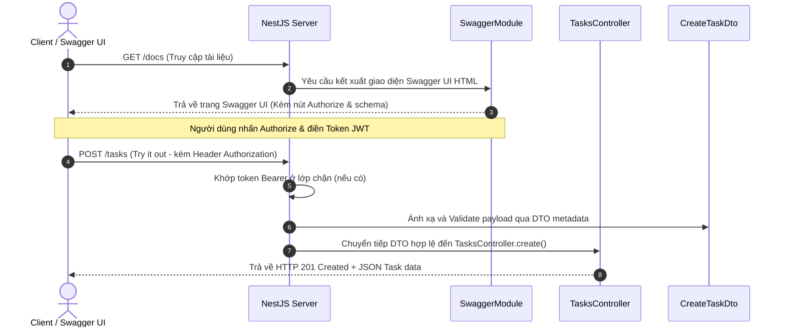

# Task Management REST API with Swagger Documentation

Hệ thống quản lý công việc (Task Management) được tích hợp tài liệu hướng dẫn giao diện lập trình ứng dụng (API Documentation) tự động bằng cách sử dụng `@nestjs/swagger` theo chuẩn OpenAPI Spec.

---

## 1. Challenge Description

Bài toán tập trung xây dựng hệ thống tài liệu API trực quan và chuyên nghiệp:
- **Cấu hình Swagger toàn cục**:
  - Mount Swagger UI tại đường dẫn `/docs`.
  - Định nghĩa metadata của API sử dụng `DocumentBuilder` bao gồm `setTitle`, `setDescription`, và `setVersion`.
  - Đăng ký cơ chế xác thực Token Bearer bằng phương thức `addBearerAuth()`.
- **Trang trí DTO & Model Schema**:
  - Trang trí `CreateTaskDto` bằng decorator `@ApiProperty` để tự động hóa sinh tài liệu schema và prefill mẫu payload giúp kiểm thử nhanh qua tính năng "Try it out".
  - Trang trí thực thể `Task` để mô tả kiểu dữ liệu phản hồi (Response type) giúp frontend nắm bắt được cấu trúc JSON trả về.
- **Annotate Controller Endpoints**:
  - Phân nhóm API bằng tag `Tasks` thông qua `@ApiTags()`.
  - Mô tả chức năng của từng endpoint bằng `@ApiOperation()`.
  - Gắn tài liệu mã phản hồi bằng `@ApiResponse()` (VD: `201 success`, `400 invalid`, `404 not found`).
  - Gắn `@ApiBearerAuth()` ở controller level để tích hợp nút Authorize xác thực JWT Bearer cho toàn bộ API Tasks.

---

## 2. How to Run

### Yêu cầu môi trường
- **Node.js**: >= 18.x
- **npm**: >= 9.x

### Lệnh khởi chạy và kiểm thử

1. **Khởi chạy máy chủ (Listening on port 3000)**:
   ```bash
   npm run start:dev
   ```

2. **Truy cập Giao diện Swagger UI**:
   - Mở trình duyệt và truy cập: `http://localhost:3000/docs`

3. **Truy cập Raw OpenAPI Spec (JSON)**:
   - Truy cập: `http://localhost:3000/docs-json`

4. **Chạy các bộ kiểm thử tự động**:
   ```bash
   npm test
   npm run test:e2e
   ```

---

## 3. Architecture / Stack

Hệ thống được phát triển trên các thư viện cốt lõi:
- **NestJS v11.x**, **TypeScript v5.7**
- **@nestjs/swagger v11.x**: Động cơ sinh tài liệu tự động qua decorator metadata.
- **class-validator** & **class-transformer** làm động cơ kiểm thực.

### Sơ đồ luồng hoạt động Swagger (Mermaid Diagram)



---

## 4. Smoke Test (Evidence Thực Tế)

Dưới đây là bằng chứng thực tế được thu thập trực tiếp khi chạy và tương tác với Swagger UI của máy chủ NestJS:

### Case 1: Đọc Raw OpenAPI Specification JSON (`GET /docs-json`)
- **Request**:
  ```bash
  curl -s http://localhost:3000/docs-json
  ```
- **Response Spec (Trích xuất các thành phần cốt lõi)**:
  ```json
  {
    "openapi": "3.0.0",
    "info": {
      "title": "Task Management API",
      "description": "Task Management API description",
      "version": "1.0",
      "contact": {}
    },
    "paths": {
      "/tasks": {
        "post": {
          "operationId": "TasksController_create",
          "parameters": [],
          "requestBody": {
            "required": true,
            "content": {
              "application/json": {
                "schema": {
                  "$ref": "#/components/schemas/CreateTaskDto"
                }
              }
            }
          },
          "responses": {
            "201": {
              "description": "Task created successfully",
              "content": {
                "application/json": {
                  "schema": {
                    "$ref": "#/components/schemas/Task"
                  }
                }
              }
            },
            "400": {
              "description": "Invalid request payload"
            }
          },
          "tags": ["Tasks"],
          "security": [{"bearer": []}]
        }
      }
    },
    "components": {
      "schemas": {
        "CreateTaskDto": {
          "type": "object",
          "properties": {
            "title": {
              "type": "string",
              "example": "Fix login bug",
              "description": "The title of the task",
              "minLength": 3,
              "maxLength": 100
            },
            "description": {
              "type": "string",
              "example": "Investigate why users cannot log in and fix the root cause.",
              "description": "A detailed description of the task",
              "maxLength": 500
            },
            "priority": {
              "type": "string",
              "enum": ["low", "medium", "high"],
              "example": "high",
              "description": "The priority of the task"
            }
          },
          "required": ["title"]
        },
        "Task": {
          "type": "object",
          "properties": {
            "id": {
              "type": "string",
              "example": "mpu88ybs53q",
              "description": "The unique identifier of the task"
            },
            "title": {
              "type": "string",
              "example": "Fix login bug",
              "description": "The title of the task"
            },
            "description": {
              "type": "string",
              "example": "Investigate why users cannot log in and fix the root cause.",
              "description": "A detailed description of the task"
            },
            "status": {
              "type": "string",
              "enum": ["PENDING", "IN_PROGRESS", "COMPLETED"],
              "example": "PENDING",
              "description": "The current status of the task"
            }
          },
          "required": ["id", "title", "status"]
        }
      },
      "securitySchemes": {
        "bearer": {
          "scheme": "bearer",
          "bearerFormat": "JWT",
          "type": "http"
        }
      }
    }
  }
  ```

### Case 2: Tạo công việc qua Swagger UI "Try it out" (`POST /tasks`) -> `201 Created`
Khi nhấn "Execute" với body được prefill tự động từ `@ApiProperty`:
- **Request URL**: `http://localhost:3000/tasks`
- **Request Body**:
  ```json
  {
    "title": "Test from Swagger",
    "description": "Testing API documentation",
    "priority": "high"
  }
  ```
- **Response Body**:
  ```json
  {
    "statusCode": 201,
    "message": "SUCCESS",
    "data": {
      "id": "mpv1i0h33q8",
      "title": "Test from Swagger",
      "description": "Testing API documentation",
      "status": "PENDING"
    },
    "timestamp": "2026-06-01T10:02:20.008Z"
  }
  ```

### Case 3: Lấy danh sách qua Swagger UI "Try it out" (`GET /tasks`) -> `200 OK`
- **Request URL**: `http://localhost:3000/tasks`
- **Response Body**:
  ```json
  {
    "statusCode": 200,
    "message": "SUCCESS",
    "data": [
      {
        "id": "1",
        "title": "Học NestJS",
        "status": "PENDING",
        "description": ""
      },
      {
        "id": "mpv1i0h33q8",
        "title": "Test from Swagger",
        "description": "Testing API documentation",
        "status": "PENDING"
      }
    ],
    "timestamp": "2026-06-01T10:02:20.011Z"
  }
  ```

---

## 5. Code Execution Trace (Flow Khởi tạo Swagger)

Quá trình quét metadata và khởi chạy giao diện tài liệu Swagger đi qua các điểm chạm sau:

1. **Điểm chạm 1 - Đăng ký Module & Cấu hình Docs Path**:
   - **File & Dòng**: [src/main.ts:35](file:///d:/Nghia-project/escape-beta/task-management/src/main.ts#L35)
   - **Mã nguồn**:
     ```typescript
     const config = new DocumentBuilder()
       .setTitle('Task Management API')
       .setDescription('Task Management API description')
       .setVersion('1.0')
       .addBearerAuth()
       .build();
     const document = SwaggerModule.createDocument(app, config);
     SwaggerModule.setup('docs', app, document);
     ```
   - **Mô tả**: Khởi tạo SwaggerModule và mount giao diện tài liệu UI lên đường dẫn `/docs`.

2. **Điểm chạm 2 - Controller Route Annotations**:
   - **File & Dòng**: [src/tasks/tasks.controller.ts:26](file:///d:/Nghia-project/escape-beta/task-management/src/tasks/tasks.controller.ts#L26)
   - **Mã nguồn**:
     ```typescript
     @Post()
     @ApiOperation({ summary: 'Create a new task' })
     @ApiResponse({ status: 201, type: Task, description: 'Task created successfully' })
     @ApiResponse({ status: 400, description: 'Invalid request payload' })
     create(@Body() createTaskDto: CreateTaskDto): Task
     ```
   - **Mô tả**: Gắn metadata mô tả endpoint và định nghĩa các mã HTTP status phản hồi có thể trả về.

3. **Điểm chạm 3 - DTO Property Mapping**:
   - **File & Dòng**: [src/tasks/dto/create-task.dto.ts:10](file:///d:/Nghia-project/escape-beta/task-management/src/tasks/dto/create-task.dto.ts#L10)
   - **Mã nguồn**:
     ```typescript
     @ApiProperty({
       example: 'Fix login bug',
       description: 'The title of the task',
       minLength: 3,
       maxLength: 100,
     })
     title: string;
     ```
   - **Mô tả**: Khai báo ví dụ (example) và các ràng buộc dữ liệu trực quan cho Schema Object trên giao diện tài liệu.

---

## 6. Design Decisions

### A. Chọn mount Swagger UI tại `/docs` thay vì `/api` hoặc `/swagger`
- **Quyết định**: Cấu hình đường dẫn tài liệu mặc định là `/docs`.
- **Trade-off (Tính phổ biến và bảo mật vs Tiêu chuẩn mặc định)**:
  - *Sử dụng `/docs`*: Rất trực quan và phổ biến đối với các nhà phát triển frontend khi tìm kiếm tài liệu (phù hợp với thói quen tìm kiếm thư mục `/docs` hoặc `/documentation`). Đồng thời, nó tách biệt hoàn toàn với phân vùng API chạy thực tế (thường mount ở `/api/v1/...`), giúp dễ dàng cấu hình quy tắc bảo mật chặn truy cập `/docs` ở môi trường production ở mức Reverse Proxy (Nginx/Cloudflare).
  - *Sử dụng `/swagger` hoặc `/api`*: Lộ ra cấu trúc tài liệu quá lộ liễu cho hacker dò tìm, đồng thời dễ xung đột đường dẫn nếu API chính thức cũng bắt đầu bằng `/api`.

### B. Sử dụng Decorator-Driven Swagger Spec thay vì viết tay YAML/JSON
- **Quyết định**: Sử dụng `@nestjs/swagger` để tự động sinh tài liệu từ mã nguồn.
- **Trade-off (Tính nhất quán & Tốc độ phát triển vs Độ tách biệt của tài liệu)**:
  - *Decorator-Driven (Sinh tự động)*: Giúp code trở thành "Single Source of Truth". Khi lập trình viên thay đổi trường dữ liệu hoặc validator trong DTO class, tài liệu Swagger sẽ tự động cập nhật ngay khi build mà không sợ bị lệch pha (out of sync). 
  - *Viết tay YAML/JSON*: Giúp mã nguồn controller sạch hơn, không bị rối mắt bởi lượng lớn decorator. Tuy nhiên, nó đòi hỏi lập trình viên phải duy trì hai file độc lập, rất dễ xảy ra sai lệch thông tin khi dự án mở rộng nhanh chóng.

### C. Sử dụng Nested DTO thay vì Single Flat Object
- **Quyết định**: Tách thông tin địa chỉ ra thành một DTO con `AddressDto` lồng bên trong `CreateUserDto` thay vì đưa toàn bộ các trường `street`, `city`, `zipCode` lên cùng cấp với `email`.
- **Trade-off (Tính module hóa & Khả năng tái sử dụng vs Sự phức tạp khi validate)**:
  - *Sử dụng Nested DTO*: Giúp cấu trúc dữ liệu rõ ràng hơn, phản ánh đúng mô hình domain (một User có một Address). `AddressDto` có thể được tái sử dụng ở các endpoint khác (ví dụ: cập nhật địa chỉ, đăng ký nhà cung cấp). Để validate nested object, NestJS yêu cầu kết hợp `@ValidateNested()` từ `class-validator` và `@Type(() => AddressDto)` từ `class-transformer` để ép kiểu JSON object sang instance của DTO class trước khi áp dụng các luật kiểm thực.
  - *Sử dụng Flat Object*: Code validate đơn giản hơn vì không cần cấu hình transformer. Tuy nhiên, nó làm phình to payload DTO, phá vỡ nguyên lý hướng đối tượng và gây khó khăn khi muốn tái sử dụng cụm thông tin địa chỉ ở nơi khác.

### D. Triển khai Custom Validator `IsCorporateEmail` thông qua `registerDecorator`
- **Quyết định**: Xây dựng một decorator tự định nghĩa `@IsCorporateEmail()` để chặn các email từ nhà cung cấp công cộng (gmail.com, yahoo.com, v.v.).
- **Trade-off (Tính linh hoạt & Tránh lỗi bypass vs Tận dụng validator có sẵn)**:
  - *Custom Validator*: Cho phép kiểm soát chặt chẽ quy trình so khớp email. Việc chuyển domain về dạng chữ thường (`.toLowerCase()`) trước khi so sánh giúp ngăn chặn việc bypass qua các email viết hoa dạng `user@GMAIL.COM` hay `user@Yahoo.Com`. Đồng thời, thông báo lỗi có thể tùy chỉnh rõ ràng hơn.
  - *Regex/Dùng thư viện thứ ba*: Có thể nhanh hơn nhưng khó xử lý triệt để tất cả các case bypass chữ hoa/chữ thường, đồng thời khó bảo trì danh sách blockList khi dự án phát triển.

