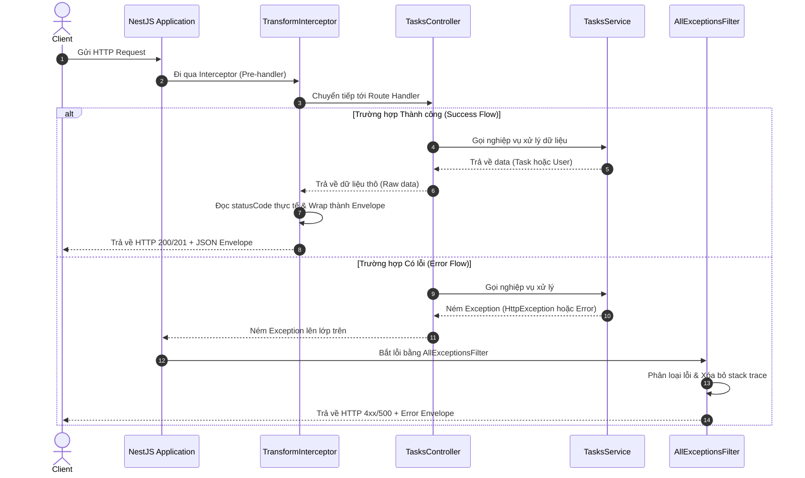

# Unified Response & Exception Filters with NestJS

Dự án triển khai cơ chế đồng bộ hóa Response Envelope thông qua NestJS Interceptors và Exception Filters toàn cục, đảm bảo mọi phản hồi (thành công hoặc lỗi) từ API đều có chung một định dạng chuẩn hóa, an toàn bảo mật và không lộ lọt thông tin nhạy cảm.

---

## 1. Challenge Description

Bài toán tập trung xây dựng cơ sở hạ tầng phản hồi đồng nhất (Unified Response Envelope) và quản lý lỗi tập trung ở biên ứng dụng:
- **Response Transformation**: Triển khai `TransformInterceptor` bọc mọi success response thành dạng JSON chuẩn:
  ```json
  { "statusCode": number, "message": string, "data": any, "timestamp": string }
  ```
  Yêu cầu: `statusCode` phải được đọc trực tiếp từ HTTP response context thay vì hardcode giá trị `200`.
- **Exception Filtering**: Triển khai `AllExceptionsFilter` sử dụng decorator `@Catch()` để bắt mọi lỗi (bao gồm lỗi NestJS `HttpException` và lỗi runtime `Error` thông thường).
  - Đối với `HttpException`: Lấy mã status qua `getStatus()` và trích xuất thông báo lỗi chính xác.
  - Đối với lỗi hệ thống/lỗi code (`Error`): Map về HTTP Status `500 Internal Server Error`, ẩn thông điệp nhạy cảm và **hoàn toàn loại bỏ stack trace** khỏi response để tránh lộ lọt thông tin bảo mật hệ thống.
  - Định dạng lỗi JSON chuẩn:
    ```json
    { "statusCode": number, "error": string, "message": string, "timestamp": string, "path": string }
    ```
- **Xác thực dữ liệu đệ quy & Custom Email Validator**: Tích hợp module `Users` có xác thực nested địa chỉ qua `@ValidateNested()` + `@Type()` và custom validator `@IsCorporateEmail()` chặn domain công cộng.

---

## 2. How to Run

### Yêu cầu môi trường
- **Node.js**: >= 18.x
- **npm**: >= 9.x

### Lệnh chạy kiểm thử và vận hành

1. **Khởi chạy kiểm thử đơn vị (Unit Tests)**:
   ```bash
   npm test
   ```

2. **Khởi chạy kiểm thử tích hợp (E2E Integration Tests)**:
   ```bash
   npm run test:e2e
   ```

3. **Biên dịch dự án**:
   ```bash
   npm run build
   ```

4. **Khởi chạy máy chủ**:
   ```bash
   node dist/main.js
   ```

---

## 3. Architecture / Stack

Hệ thống sử dụng:
- **NestJS v11.x**, **TypeScript v5.7**, **class-validator** & **class-transformer**.
- **Winston Logger** phục vụ ghi nhận log sự kiện.
- **Supertest** để chạy tích hợp.

### Sơ đồ Quy trình Xử lý Response (Mermaid Diagram)



---

## 4. Smoke Test (Evidence Thực Tế)

Dưới đây là log response thực tế thu được từ máy chủ NestJS cho cả 3 flow nghiệp vụ:

### Case 1: Lấy danh sách thành công (GET /tasks) -> HTTP 200 Envelope
- **Request**:
  ```bash
  curl -s http://localhost:3000/tasks
  ```
- **Response**:
  ```json
  {
    "statusCode": 200,
    "message": "SUCCESS",
    "data": [
      {
        "id": "1",
        "title": "Học NestJS",
        "status": "PENDING",
        "description": ""
      }
    ],
    "timestamp": "2026-06-01T03:01:45.428Z"
  }
  ```

### Case 2: Tìm kiếm ID không tồn tại (GET /tasks/999) -> HTTP 404 Envelope
- **Request**:
  ```bash
  curl -s http://localhost:3000/tasks/999
  ```
- **Response**:
  ```json
  {
    "statusCode": 404,
    "error": "NotFoundException",
    "message": "Task with ID \"999\" not found",
    "timestamp": "2026-06-01T03:01:45.439Z",
    "path": "/tasks/999"
  }
  ```

### Case 3: Gây sập hệ thống (GET /tasks/crash) -> HTTP 500 Envelope (Không có Stack Trace)
- **Request**:
  ```bash
  curl -s http://localhost:3000/tasks/crash
  ```
- **Response**:
  ```json
  {
    "statusCode": 500,
    "error": "Internal Error",
    "message": "Internal Server Error",
    "timestamp": "2026-06-01T03:01:45.441Z",
    "path": "/tasks/crash"
  }
  ```

### Case 4: Minh họa bỏ quên `@Type` trong xác thực người dùng
Khi thực hiện validate lồng đệ quy địa chỉ người dùng (`address`), nếu bỏ quên decorator `@Type(() => AddressDto)`, `class-validator` sẽ không nhận diện được constructor của class con và bypass qua bước xác thực thuộc tính con (ví dụ `zipCode`). 

Dưới đây là phần code diff minh họa lỗi này:
```diff
  export class CreateUserDto {
    @IsEmail()
    @IsCorporateEmail()
    email: string;
 
    @IsDefined({ message: 'address is required' })
    @ValidateNested()
-   @Type(() => AddressDto)
    address: AddressDto;
  }
```
*Kết quả khi thiếu `@Type`*: Request chứa zipCode sai (ví dụ `"zipCode": "12"`) vẫn sẽ được server lưu thành công với status `201 Created` thay vì bị chặn lại bởi lỗi `400 Bad Request`.

---

## 5. Code Execution Trace (Flow GET /tasks)

Dưới đây là sơ đồ trace chi tiết mô tả đường đi của request thành công qua các điểm chạm trong source code ứng dụng:

1. **Điểm chạm 1 - Controller Entry**:
   - **File & Dòng**: [tasks.controller.ts:30](file:///d:/Nghia-project/escape-beta/task-management/src/tasks/tasks.controller.ts#L30)
   - **Method**: `findAll()`
   - **Mô tả**: Ghi nhận HTTP request `GET /tasks` và gọi phương thức tương ứng của `TasksService`.

2. **Điểm chạm 2 - Service Logic**:
   - **File & Dòng**: [tasks.service.ts:23](file:///d:/Nghia-project/escape-beta/task-management/src/tasks/tasks.service.ts#L23)
   - **Method**: `findAll()`
   - **Mô tả**: Trích xuất toàn bộ mảng dữ liệu task từ Map in-memory và trả về cho Controller.

3. **Điểm chạm 3 - Outbound Interceptor Wrapping**:
   - **File & Dòng**: [transform.interceptor.ts:6](file:///d:/Nghia-project/escape-beta/task-management/src/tasks/interceptors/transform.interceptor.ts#L6)
   - **Method**: `intercept(context, next)`
   - **Mô tả**: Bắt lấy dữ liệu trả về từ controller ở dòng 7, đọc mã trạng thái HTTP thực tế tại dòng 9 (`statusCode: context.switchToHttp().getResponse().statusCode`), đóng gói chúng vào định dạng envelope và phản hồi về client.

---

## 6. Design Decisions

### A. Chọn Global Interceptor + Filter thay vì Decorator per-controller
- **Quyết định**: Sử dụng `app.useGlobalInterceptors()` và `app.useGlobalFilters()` trong file khởi chạy ứng dụng.
- **Trade-off (DRY & Nhất quán vs Tính linh hoạt cục bộ)**:
  - *Sử dụng toàn cục (Global)*: Giúp toàn bộ API của hệ thống thống nhất một format phản hồi, tránh tình trạng viết code format thủ công trong từng API, bảo vệ hệ thống khỏi việc leak stack trace khi lập trình viên quên gắn decorator.
  - *Sử dụng cục bộ (Per-controller)*: Tốt cho các hệ thống lai (ví dụ vừa trả về JSON API vừa render HTML views). Tuy nhiên, đối với hệ thống thuần REST API, dùng cục bộ dễ dẫn đến thiếu sót và không đồng bộ cấu trúc lỗi.

### B. Chọn `registerDecorator` thay vì Class implement `ValidatorConstraintInterface`
- **Quyết định**: Dùng `registerDecorator` cho `@IsCorporateEmail()`.
- **Trade-off (Sự tinh gọn vs Khả năng nhúng dependency)**:
  - *Dùng `registerDecorator`*: Code tinh gọn, đóng gói logic validate nhỏ trong cùng một file, dễ viết unit test độc lập.
  - *Dùng Class Interface*: Cho phép tiêm (inject) các service khác (như TypeORM Repository) để kiểm tra dữ liệu từ database. Tuy nhiên, nó tăng độ phức tạp trong việc đăng ký DI container.

### C. Chọn Block List dạng Hardcode thay vì Config-Driven
- **Quyết định**: Lưu danh sách domain cấm trực tiếp dưới dạng mảng tĩnh.
- **Trade-off (Sự độc lập khi deploy vs Sự linh hoạt cấu hình)**:
  - *Hardcode*: Giúp ứng dụng độc lập tuyệt đối khi chạy kiểm thử (Unit test/E2E), đảm bảo test suite luôn chạy ổn định mà không cần mock file cấu hình.
  - *Config-driven*: Cho phép thay đổi blocklist qua biến môi trường (.env) không cần build lại code, nhưng tăng nguy cơ crash runtime nếu biến môi trường cấu hình sai hoặc thiếu.
